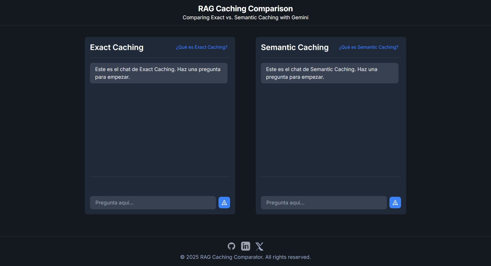

# RAG Caching Comparator

Comparador visual de técnicas de caching: Exact Caching vs. Semantic Caching.




## Descripción

Esta aplicación permite comparar en tiempo real el comportamiento y rendimiento de dos técnicas de caching para sistemas de recuperación aumentada por generación (RAG):
- **Exact Caching:** Responde solo si la pregunta es exactamente igual a una cacheada.
- **Semantic Caching:** Responde si la pregunta es semánticamente similar a una cacheada, usando embeddings.

## Tecnologías
- React 19 + Vite
- TypeScript
- TailwindCSS (CDN)

## Instalación y uso

**Requisitos:** Node.js >= 18

1. Clona el repositorio y entra en la carpeta del proyecto:
   ```bash
   git clone <url-del-repo>
   cd rag-caching-comparator
   ```
2. Instala las dependencias:
   ```bash
   npm install
   ```
3. Crea un archivo `.env` en la raíz del proyecto con el siguiente contenido:
   ```env
   VITE_ENDPOINT_EXACT=http://127.0.0.1:8000/rag/query_exact
   VITE_ENDPOINT_SEMANTIC=http://127.0.0.1:8000/rag/query_semantic
   ```
   > Cambia las URLs si tu backend está en otra dirección.

4. Inicia la aplicación en modo desarrollo:
   ```bash
   npm run dev
   ```
   Abre [http://localhost:5173](http://localhost:5173) en tu navegador.

## Variables de entorno

- `VITE_ENDPOINT_EXACT`: Endpoint para consultas exactas.
- `VITE_ENDPOINT_SEMANTIC`: Endpoint para consultas semánticas.

## Estructura principal
- `App.tsx`: Layout general y modales de ayuda.
- `components/ChatColumn.tsx`: Lógica y UI de cada chat.
- `services/chatApiService.ts`: Llamadas a los endpoints del backend.
- `public/screenshot.png`: Imagen de referencia del frontend.

## Licencia

Este repositorio se publica bajo la licencia [MIT](LICENSE).  
Eres libre de usar, modificar y compartir este contenido según los términos de la licencia.

---

Este proyecto fue desarrollado con fines educativos y de exploración técnica.  
Para sugerencias o mejoras, puedes abrir un issue o pull request.
